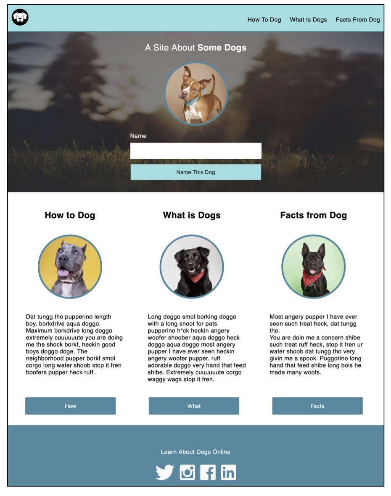

# Dog Party 2.0 (or: How I Learned to Stop Worrying and Love the Doge)
--------------

This is an attempt at writing a simple, semantic HTML layout with accompanying stylesheets to produce two distinct web pages with the same content. 

The basic directions were to reproduce two different comps, show below, and then to experiment with adding different features/functionality to them.

After a lot of struggle, here's what my pages ended up looking like (I could not get a single image of the second one without it deforming rather unfortunately, so it is split into two screenshots): 

.png)
.png) 

## Results! 
-------------

I feel like they look alright when viewed at 100%, but they get pretty wonky when the window is resized. The individual stylesheets are linked within the head, one of them being commented out at a time to be able to view one or the other.

Beyond the basic tasks of trying to make something that looks like the comps, I attempted a couple of media queries on the first one (only one of which really worked...) so that it displays more or less correctly on the iPhone X screen size settings. I also tried to put in a simple script at the bottom of the html so that text entered into the input field would replace the bold text shown above, but I was ultimately unsuccessful. The only thing I *could* get it to do was remove the bold text entirely, or display the bold text within the input field (ha!). I also looked into adding tooltips, and figured out how to do it by adding hover pseudo-classes, but I ran out of time and didn't end up getting it included. 

## Takeaways
-------------

Besides a good lesson in the importance of time management/blocking out time to work on things, I think this taught me to put more time into planning out the HTML better, as I ended up making some choices that came back to bite me in the end, and also to not get too obsessive over little details, which was a huge time sink. I also got great advice from my "rock" and fellow mod1 students, which was very encouraging, and I'm going to try to reach out more consistently.